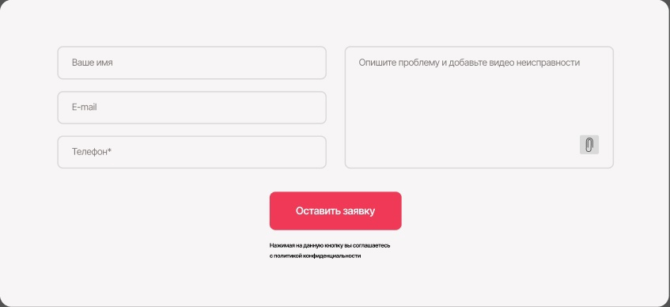
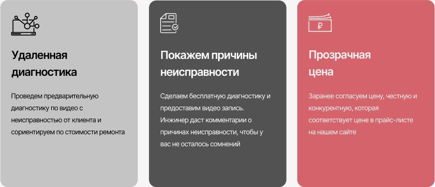

# 1. Header: `header.header>img.header__logo+(ul.header__list>li.header__item*4>a.header__link)+a.number.header__number`

# 2. Form: `form.form>(.form__left>input.form__name+input.form__email+input.form__number)+(.form__right>textarea.form__problem+img.form__img)+.form__bottom>button.form__button+p.form__text`

# 3. Cards: `.cards>.card*3>.card__img+h3.card__h3+p.card__text`

# 4. Reviews: `.reviews>.review*3>(.review__top>h4.review__name+a.review__date+img.review__map-logo)+.review__main+.review__bottom>a.review__read-completely+img.review__stars`

